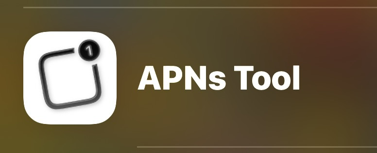
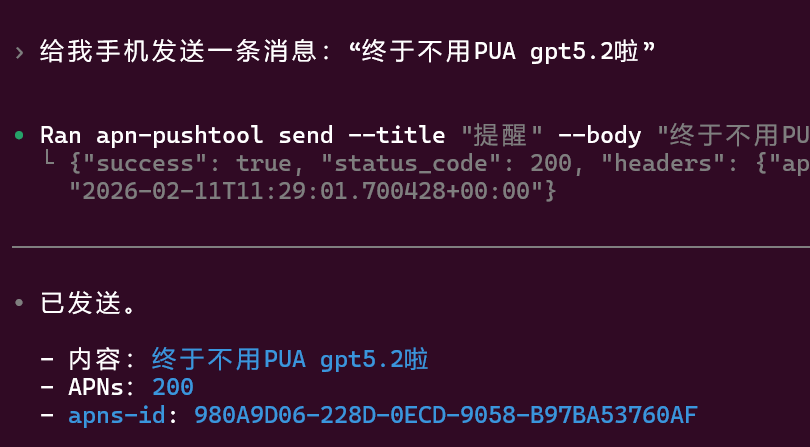

# apn-pushtool

Chinese README: `README.zh_ch.md`

Python CLI for sending Apple Push Notification service (APNs) pushes to an iOS device using JWT (Auth Key / `.p8`) + HTTP/2.

## iOS Prerequisite
You need an iPhone app that can:
- provide a valid **Device Token**
- receive the push notifications you send

Recommended: install **“APNs Tool”** from the App Store, then open the **Credentials** tab to get:
- `APNS_TEAM_ID`, `APNS_KEY_ID`, `APNS_BUNDLE_ID`, `APNS_DEVICE_TOKEN`, `APNS_ENV`
- the **P8 private key content** (copy/paste it into a local file and save it as `*.p8`)



## Screenshots



## Install
### Project deps (for development / tests)
```powershell
uv sync
```

### Global CLI (recommended)
After this, you can run `apn-pushtool` from anywhere (no `uv run ...`).
```powershell
uv tool install -e .
uv tool update-shell
```

Or install directly from GitHub on a new machine:
```powershell
uv tool install git+https://github.com/lemonhall/apn_pushtool
uv tool update-shell
```

Re-open your terminal, then verify:
```powershell
apn-pushtool --help
```

## Config (.env + .p8)
Copy the template:
```powershell
Copy-Item .env.example .env
notepad .env
```

Put your `.env` and `.p8` next to the installed Codex skill (recommended), so everything works from any directory:
```text
C:\Users\<you>\.agents\skills\apn-pushtool\
├── SKILL.md
└── secrets\
    ├── .env
    └── apns_authkey.p8
```

In `.env`, if `.p8` is in the same folder, you can use a relative path:
- `APNS_P8_PATH=apns_authkey.p8` (resolved relative to the `.env` file location)

Optional: set a user-level default dotenv path:
```powershell
[Environment]::SetEnvironmentVariable("APNS_DOTENV", "$HOME\.agents\skills\apn-pushtool\secrets\.env", "User")
```

## Usage
```powershell
apn-pushtool doctor
apn-pushtool send --title "Reminder" --body "Time to eat"
```

## Using in Codex via SKILL
Once the skill is installed at `~/.agents/skills/apn-pushtool/`, trigger it in chat:
- `$apn-pushtool send a push saying: time to eat`

## Tests
Offline tests (default):
```powershell
uv run pytest
```

E2E (real APNs push, opt-in):
```powershell
$env:APNS_E2E='1'
uv run pytest -m e2e -q
```
